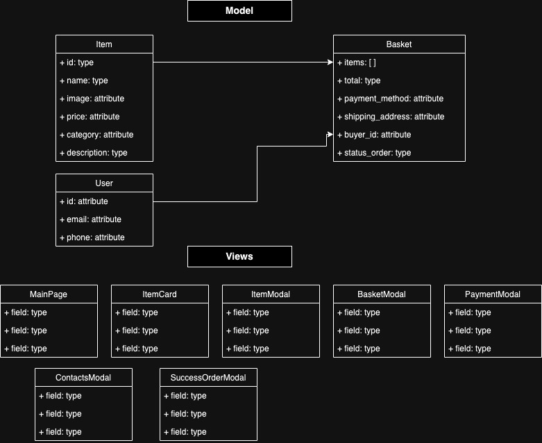

# Проектная работа "Веб-ларек"

Стек: HTML, SCSS, TS, Webpack

Структура проекта:
- src/ — исходные файлы проекта
- src/components/ — папка с JS компонентами
- src/components/base/ — папка с базовым кодом

Важные файлы:
- src/pages/index.html — HTML-файл главной страницы
- src/types/index.ts — файл с типами
- src/index.ts — точка входа приложения
- src/styles/styles.scss — корневой файл стилей
- src/utils/constants.ts — файл с константами
- src/utils/utils.ts — файл с утилитами

## Установка и запуск
Для установки и запуска проекта необходимо выполнить команды

```
npm install
npm run start
```

или

```
yarn
yarn start
```
## Сборка

```
npm run build
```

или

```
yarn build
```

## Описание проекта
Проект "Web-larek" реализует пример работы интернет-магазина. Главная страница содержит каталог товаров. Пользователь может просматривать товары. При нажатии на карточку товара открывается окно с детальной информацией о товаре. При нажатии на иконку корзины открывается корзина. При просмотре товара у пользователя есть возможность добавить товар в корзину по кнопке Купить или удалить из корзины ранее добавленный товар по кнопке Убрать. Проект реализован на TypeScript и представляет собой SPA (Single Page Application) с использованием API для получения данных о товарах.


## Архитектура проекта
Приложение реализует MVP-паттерн. Логика разделена на слои:

1) Model (Модель) — отвечает за данные. Модель ничего не знает о пользовательском интерфейсе.
Здесь выделены 3 сущности: Item, Basket и User. Интерфейсы товара, корзины и пользователя описаны в index.ts

Синхронизация моделей данных с сервером делается с помощью следующих функций:
fetchItems
addItemToBasket
deleteItemToBasket
submitOrder

2) View (Представление) — отвечает за отображение данных пользователю и взаимодействие с ним. Это визуальная часть приложения. View получает команды от Presenter и отображает данные, но сама не выполняет никакую бизнес-логику.

Представление охватывает следующие пользовательские сценарии:
Просмотр каталога товаров и взаимодействие с корзиной (MainPageView)
Просмотр карточки товара в модальном окне (ItemModalView)
Просмотр малой карточки товара (ItemCardView)
Просмотр корзины (BasketModalView)
Оформление заказа (Оплата и доставка- PaymentModalView, данные получателя- ContactsModalView)
Информирование пользователя об успешном заказе (SuccessOrderModalView)

Интерфейсы всех представлений описаны в index.ts

Так как модальные окна в проекте однотипные, то их общая логика и структура вынесена в абстрактный класс ModalForm. Все модальные окна наследуются от него и переопределяют методы для своих нужд.

3) Presenter (Презентер) — посредник между View и Model (EventEmitter). Он получает данные от Model, обрабатывает их, если нужно, и передает их в View. Также Presenter обрабатывает действия пользователя, которые происходят во View, и решает, как на них реагировать, взаимодействуя с Model.




